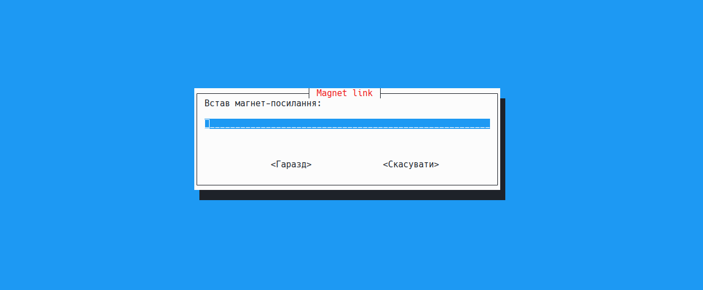

# Tlink 🎬  

Простий Bash-скрипт для перегляду та завантаження magnet у терміналі.  

```
#!/bin/bash

DOWNLOAD_PATH="встав свій шлях"

while true; do
    link=$(whiptail --inputbox "Встав магнет-посилання:" 10 60 --title "Magnet link" 3>&1 1>&2 2>&3)

    if [[ $? -ne 0 ]]; then
        exit 0  # Вихід, якщо користувач натиснув "Скасувати"
    fi

    if [[ -z "$link" ]]; then
        whiptail --msgbox "Помилка: Магнет-посилання не може бути порожнім!" 10 50
        continue
    fi

    option=$(whiptail --title "Вибір дії" --menu "Що робити з цим торентом?" 15 60 5 \
        "1" "Дивитись торрент (mpv)" \
        "2" "Завантажити у $DOWNLOAD_PATH" \
        "3" "Вийти в термінал" \
        "4" "Повернутись до вводу магнет-лінка" 3>&1 1>&2 2>&3)

    case $option in
        1) 
            webtorrent --mpv "$link"
            ;;
        2) 
            webtorrent download -o "$DOWNLOAD_PATH" "$link"
            ;;
        3) 
            clear
            exit 0
            ;;
        4) 
            continue
            ;;
        *) 
            whiptail --msgbox "Некоректний вибір. Спробуй ще раз." 10 50
            ;;
    esac
done
```


## 🔥 Можливості  
- Дивитися торренти через **mpv**  
- Завантажувати файли у **Додай свій шлях для завантаження в скрипт**  
- Зручне текстове меню через **Whiptail**  
- Кнопки для повернення в меню або виходу  

## 🚀 Встановлення  
1. Встанови `webtorrent-cli`:

   npm install -g webtorrent-cli

   yay -S webtorrent-cli    # Arch 

Додай Whiptail, якщо його нема:

sudo apt install whiptail   # Debian/Ubuntu  
sudo pacman -S libnewt      # Arch  
sudo dnf install newt       # Fedora
